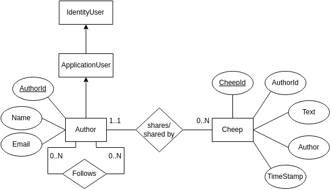
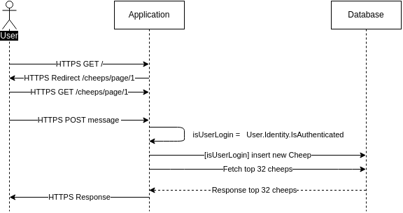

- [Design and Architecture](#design-and-architecture)
  - [Domain model](#domain-model)
  - [Architecture - in the small](#architecture---in-the-small)
  - [Architecture of deployed application](#architecture-of-deployed-application)
  - [User activities](#user-activities)
  - [Sequence of functionalities/call through Chirp](#sequence-of-functionalitiescall-through-chirp)
- [Process](#process)
  - [Build, test, release and deployment](#build-test-release-and-deployment)
  - [Team work](#team-work)
  - [Missing Features](#missing-features)
    - [DTOs](#dtos)
    - ["Forget me" feature](#forget-me-feature)
    - [End-to-end test](#end-to-end-test)
    - [Security](#security)
    - [Bugs](#bugs)
  - [How to Run Chirp! Locally](#how-to-run-chirp-locally)
    - [Setting up the Chirp application](#setting-up-the-chirp-application)
    - [Install Dependencies](#install-dependencies)
    - [Setting up Application User Secret](#setting-up-application-user-secret)
    - [Starting the Application](#starting-the-application)
    - [How to run test suite locally](#how-to-run-test-suite-locally)
- [Ethics](#ethics)
  - [License](#license)
  - [LLMs, ChatGPT, CoPilot and others](#llms-chatgpt-copilot-and-others)

https://github.com/itu-bdsa/lecture_notes/blob/main/sessions/session_12/README_REPORT.md
cheat sheet: https://www.markdownguide.org/cheat-sheet/

# 1 Design and Architecture

## 1.1 Domain model

The Domain model for Chirp! can be seen illustrated as an ER-diagram in the following image:

Our Cheep entity represents all Cheeps from all users. The entity contains information about the cheeps content, when it was posted and who posted it.
The Author entity contains information such as a username and e-mail. The author entity has a relation to the Cheep entity through a list of cheeps inside the author. This is necessary to find all cheeps belonging to a specific user quickly rather than matching a specific user to all cheeps in the database.
The Chirp! application has a follow function which is also represented in the Author entity. This is made as a relation to itself, an Author can follow and be followed by many other Authors.

## 1.2 Architecture - in the small

Chirps onion architecture can be seen in the next figure below.

The onion architecture diagram consists of four layers, the Core, Repository, Service and Razor.
They are called the same as their respective folders.

The red "Application Core" is a term we will use to reference the parts that deal with logic and data processing.

The Core section has our DomainModel, this includes the DBContext, Cheep and Author class. This is also where IdentityCore is implemented.

The Repository and Service layers each contain different logic methods and responsibilities.

The Razor layer is what is generally recognized as the web layer, the folder is just called 'Chirp.Razor'.
this layer contains the webpages, database and startup program for Chirp! tests are also illustrated in this layer, although they are in a separate folder.

## 1.3 Architecture of deployed application

The client component is the client box and Oauth, the server components is everything inside the Azure box. The app box consists of all the html files in the shared folder, this is what the client sees. The app background box, is the services that communicates between the app and client input and the database. The database box is pretty self-explanatory, it contains all the information from the web application. The Identity Core box is where sensitive user information and data is encrypted. 

## 1.4 User activities

The following section consists of various user activities on the Chirp application site. These activities represent typical user scenarios for using the website. The diagrams illustrate the differences between an authorized user and an unauthorized user.

The diagram above visually represents how an unauthorized user can interact with the Chirp application website. Upon entering the site, the user has several options for their next actions. They can sign in or log in if they already have an account. Alternatively, the user can browse the page and view various messages. Additionally, they can click on another user’s name to be directed to that user’s timeline.

The next illustration is of an ordinary user journey for an authorized user.

This user journey illustrates that a user can follow and un-follow other users and delete cheeps.
An authorized user can also visit the 'about me' page that displays all the information that the database has about the user. A user can also request this information in a .txt format for download.
Lastly, they can also log out of the application after which they will be redirected to the login page.

## 1.5 Sequence of functionalities/call through Chirp

This [website](https://medium.com/@joshuaudayagiri/uml-sequence-diagram-5c8d1f0b41d6) was used to get styling for a for the UML sequence diagram.

The sequence diagram above shows the call sequence for the public timeline. This call sequence is the same for authorized and unauthorized since the all cheeps timelines are public. This is also how the user timelines works, but it does not redirect and it only fetches the top 32 cheeps of the author.

The sequence diagram above shows the call sequence for when a user is posting a cheep to the application. The application checks if the user Is Authenticated before inserting it to the database. This is also how delete works but instead of post it the user sends a delete request.

The sequence diagram above show the call sequence for when a user wants to get of they information store in database.

# 2 Process

## 2.1 Build, test, release and deployment

The build and deploy workflow builds the project from chirp.razor/Chirp.Razor.csproj uploads it as an artifact. It is then loaded into the deploy phase, where the workflow also logs into the Azure server and then deploys the web application

This workflow is used to create new releases of the project for both ubuntu, windows and macOS operating systems. It first gets dependencies from dotnet, then it builds, publishes and zips the project for each OS as an artifact. When it creates the release it loads the artifacts and creates a Github release with the tag.

The test workflow makes sure that every time someone pushes to main it will run all the tests from, the crTest fo.

## 2.2 Team work

TODO

!!!! REMEBER TO ADD PICTURE OF PROJECT BOARD AND WRITE ABOUT NOT FINISHED SSUES !!!!

During the course of this program, the general workflow we used started with issue creation. From here, a separate branch would be created on Git. This branch would serve as the development environment for the issue. When developers working on a given issue deemed it finished, a pull request would be submitted, where other members could accept, comment, or deny it based on feedback. Upon a successful merge, the issue would be marked as finished, and the branch would be deleted.

In practice, however, we experienced some deviations. Issues were often created as mentioned above but sometimes forgotten, even when actively working on the related task. This was most likely due to being unfamiliar with working through issues and the small size of the group. Additionally, there was often no reason to comment or deny a given pull request since perhaps 3 out of 5 group members would work together on a given branch, leaving nothing significant to critique in the code. Branches also tended to live relatively long in our project due to being unable to finish certain functionalities or bugs before the weekend, making it awkward to merge unfinished code.

## 2.3 Missing Features

### 2.3.1 Data Transfer Objects (DTOs)

Chirp! is missing Data Transfer Objects (DTOs) to transfer information between the layers of our onion-structured application. DTOs can reduce the amount of data sent back and forth between layers of the application, and between the server and client. compared to our current solution. This implementation of DTO's, would definitely increase the efficiency of the application.

### 2.3.2 "Forget me" feature

Our application doesn't have the "Forget Me" feature requested in [Session 11](https://github.com/itu-bdsa/lecture_notes/blob/main/sessions/session_11/README_PROJECT.md). We planned on integrating this feature into your personal timeline, with a button that would delete all information stored on your account and clean up other users' follow lists. This wasn't finished due to time constraints.

### 2.3.3 End-to-end test

We have not made the required End-To-End UI mentioned in [Session 09](https://github.com/itu-bdsa/lecture_notes/blob/main/sessions/session_09/README_PROJECT.md).this is mainly due to problems with running the project from the test directory and not so much with getting Playwright to work. We would have tested certain UI components to ensure functionality, such as verifying that the option to send a cheep only appears when you are logged in, and conducting extensive tests on the functionality of certain UI elements like buttons, etc.

### 2.3.4 Security

The application has a big security issue. A user is able to add html code to other users browsers, which can lead to bad actors who can execute some problematic JavaScript code on other people’s browsers.
This security issue exists because of how the markdown syntax is parsed. To be able to show e.g. italic text, the program is replacing `*` with `<em>` tags around the text and then it uses `@Html.Raw()` to convert it from a string to html code. But this is where the problem comes, since these cheeps are not sanitized before they get displayed.
But since the bad cheeps are stored as string on the server, means that the issues does only affect the user and not affect the server.

This issue can be solved by sanitized cheeps before it gets into `@Html.Raw()`. This could be done by using a library, like [HtmlSanitizer](https://github.com/mganss/HtmlSanitizer). However since this program uses .NET 9, which was released on November 12, 2024, leading to currently not a lot of library has .NET 9 support as of the time of writing.

### 2.3.5 Bugs

1. We currently have a bug that involves the follow feature and posting cheeps feature. Whenever a user that has never posted anything tries to follow another user, that user's browser will get an error. We believe this has something to do with the way we get/fetch cheeps from a users personal timeline when trying to follow another user.
2. It is currently possible to delete another users cheeps by following them and going to ones own timeline. This is due to missing a check who the Author for certain cheeps are.
3. When creating a account with GitHub, a user is required to add email. This should not be needed, since it should use the email provided by GitHub OAuth.

## 2.4 How to Run Chirp! Locally

To run the Chirp application locally, you will first need to set up your environment.

### 2.4.1 Setting up the Chirp application

- Clone the Git repository using `git clone https://github.com/ITU-BDSA2024-GROUP29/Chirp.git`
- Install dotnet 9 [.NET 9 SDK](https://dotnet.microsoft.com/en-us/download)

### 2.4.2 Install Dependencies

To restore and install the project dependencies, navigate to the project root directory and run: `dotnet restore`

### 2.4.3 Setting up GitHub OAuth

The Chirp application uses GitHub OAuth for authentication. To configure GitHub OAuth:

- Go to the GitHub Developer Settings and create a new OAuth App:
- Application Name: Chirp Local
- Homepage URL: http://localhost:5273
- Authorization Callback URL: http://localhost:5273/signin-github

Once the app is created, note down the Client ID and Client Secret.

> Important: Keep the Client Secret secure and do not share it publicly.

### 2.4.4 Setting up Application User Secrets

To securely store and manage the GitHub OAuth credentials:

- Navigate to the Razor project directory: `cd ./src/Chirp.Razor`

- Initialize user secrets: `dotnet user-secrets init`

- Set the GitHub OAuth credentials:

`dotnet user-secrets set "authentication:github:clientId" "<your-client-id>"`  
`dotnet user-secrets set "authentication:github:clientSecret" "<your-client-secret>"`

> Replace `<your-client-id>` and `<your-client-secret>` with the values obtained from GitHub.

### 2.4.5 Starting the Application

- Navigate to the Chirp.Razor directory: `cd .\src\Chirp.Razor\ `
- Run the application with the following command: `dotnet run`
- You will see the local IP displayed in the terminal, similar to: `http://localhost:5273`

> The application relies on several dependencies defined in the .csproj file. These include:

`Microsoft.EntityFrameworkCore.Sqlite` for database operations
`AspNet.Security.OAuth.GitHub` for GitHub authentication
`Microsoft.AspNetCore.Identity` for identity management

To ensure all dependencies are installed, use: `dotnet restore`

For database migrations and other Entity Framework tasks, ensure you have the EF CLI installed:
`dotnet tool install --global dotnet-ef`

### 2.4.6 How to run test suite locally

To run our test project, follow the list below:

- Go to a specific test directory `cd .\Chirp\test\ChirpRazor.Tests\`
- Run the `dotnet test` command in your terminal.

In our test project, we cover relevant unit and integration tests for all methods within our application core. See subsection 'Architecture in the Small'  
Relevant tests, in this case, cover important and central methods for our Chirp application. This mainly includes methods used to interact with the database (Send Cheeps, Store Cheeps, etc).

# 3 Ethics

## 3.1 License

Chirp is available and covered under the [MIT License](https://opensource.org/license/mit).  
The application dependencies are also licensed under the [MIT License](https://opensource.org/license/mit).

## 3.2 LLMs, ChatGPT, CoPilot and others

ChatGPT was used during the development of this project, although it was mainly used to troubleshoot and fix errors. Co-pilot was not used during the development of this project.
We found that ChatGPT can function as a really useful tool for bug fixing and explaining why certain things act and function as they do in the .NET package. Specific information like this can, in some cases, not be easily accessible on other sites like StackOverflow or in the official documentation. For this reason, ChatGPT helped increase the development speed of our application.
