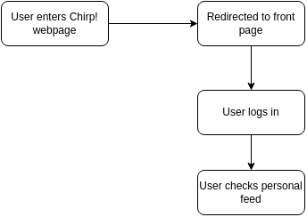
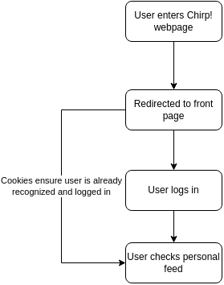

title: _Chirp!_ Project Report
subtitle: ITU BDSA 2024 Group `29`
author:
- "Jonas Christian Henriksen <chjh@itu.dk>"
- "Magnus Thor Lessing Rolin <thmr@itu.dk>"
- "Adrian Hoff <adho@itu.dk>"
- "Viktor Emil Nørskov Andersen <Viea@itu.dk>"
- "Rasmus Hassin Huge <rahu@itu.dk>"
---

- [Design and Architecture](#design-and-architecture)
  - [Domain model](#domain-model)
  - [Domain model](#domain-model-1)
  - [Architecture - in the small](#architecture---in-the-small)
  - [Architecture of deployed application](#architecture-of-deployed-application)
  - [User activities](#user-activities)
  - [User activities](#user-activities-1)
  - [Sequence of functionalities/call through Chirp](#sequence-of-functionalitiescall-through-chirp)
- [Process](#process)
  - [Build, test, release and deployment](#build-test-release-and-deployment)
  - [Team work](#team-work)
  - [Missing Features](#missing-features)
    - [DTOs](#dtos)
    - ["Forget me" feature](#forget-me-feature)
    - [End-to-end test](#end-to-end-test)
    - [Security](#security)
    - [Bugs](#bugs)
  - [How to Run Chirp! Locally](#how-to-run-chirp-locally)
    - [Setting up the Chirp application](#setting-up-the-chirp-application)
    - [Install Dependencies](#install-dependencies)
    - [Setting up Application User Secret](#setting-up-application-user-secret)
    - [Starting the Application](#starting-the-application)
  - [How to run test suite locally](#how-to-run-test-suite-locally)
- [Ethics](#ethics)
  - [License](#license)
  - [LLMs, ChatGPT, CoPilot and others](#llms-chatgpt-copilot-and-others)

https://github.com/itu-bdsa/lecture_notes/blob/main/sessions/session_12/README_REPORT.md

cheat sheet: https://www.markdownguide.org/cheat-sheet/

# 1 Design and Architecture

## 1.1 Domain model

The Domain model for Chirp! can be seen illustrated as an ER-diagram in the following image:

Our Cheep entity represents all Cheeps from all users. The entity contains information about the cheeps content, when it was posted and who posted it.
The Author entity contains information such as a username and e-mail. The author entity has a relation to the Cheep entity through a list of cheeps inside the author. This is necessary to find all cheeps belonging to a specific user quickly rather than matching a specific user to all cheeps in the database.
The Chirp! application has a follow function which is also represented in the Author entity. This is made as a relation to itself, an Author can follow and be followed by many other Authors.

## 1.2 Architecture - in the small

Chirps onion architecture can be seen in the next figure below.

The onion architecture diagram consists of four layers, the Core, Repository, Service and Razor.
They are called the same as their respective folders.

The red "Application Core" is a term we will use to reference the parts that deal with logic and data processing.

The Core section has our DomainModel, this includes the DBContext, Cheep and Author class. This is also where IdentityCore is implemented.

The Repository and Service layers each contain different logic methods and responsibilities.

The Razor layer is what is generally recognized as the web layer, the folder is just called 'Chirp.Razor'.
this layer contains the webpages, database and startup program for Chirp! tests are also illustrated in this layer, although they are in a separate folder.

## 1.3 Architecture of deployed application

## 1.4 User activities

## 1.5 Sequence of functionalities/call through Chirp

# 2 Process

##  2.1 Build, test, release and deployment

The build and deploy workflow 

##  2.2 Team work 

##   2.3 Missing Features  
###  2.3.1 DTOs
###  2.3.2 "Forget me" feature

Our application doesn't have the "Forget Me" feature requested in [Session 11](https://github.com/itu-bdsa/lecture_notes/blob/main/sessions/session_11/README_PROJECT.md). We planned on integrating this feature into your personal timeline, with a button that would delete all information stored on your account and clean up other users' follow lists. This wasn't finished due to time constraints.

###  2.3.3 End-to-end test

We have not made the required End-To-End UI mentioned in [Session 09](https://github.com/itu-bdsa/lecture_notes/blob/main/sessions/session_09/README_PROJECT.md).this is mainly due to problems with running the project from the test directory and not so much with getting Playwright to work. We would have tested certain UI components to ensure functionality, such as verifying that the option to send a cheep only appears when you are logged in, and conducting extensive tests on the functionality of certain UI elements like buttons, etc.

###  2.3.4 Security

The application has a big security issue. A user is able to add html code to other users browsers, which can lead to bad actors can execute some problematic javascript code on other peoples browsers.
This security issue exists because of how the markdown syntax is handled. To be able to show e.g. italic text, the program would need to be able to add the `<em>` tags around the text and it uses `@Html.Raw()` to convert it from a string to html code. But this is were the problem comes, since this cheeps are not sanitized before it gets displayed.
This is issues only affects the users and are affecting the server, which means that a bad cheep can be removed by a admin.

###  2.3.5 Bugs
1. 
We currently have a bug that involves the follow feature and posting cheeps feature. 

##  2.5 How to Run Chirp! Locally

To run the Chirp application locally, you will first need to set up your environment.

### 2.5.1 Setting up the Chirp application

- Clone the Git repository using `git clone https://github.com/ITU-BDSA2024-GROUP29/Chirp.git`
- Install dotnet 9 [.NET 9 SDK](https://dotnet.microsoft.com/en-us/download)

### 2.5.2 Install Dependencies

To restore and install the project dependencies, navigate to the project root directory and run: `dotnet restore`

### 2.5S3 etting up GitHub OAuth

The Chirp application uses GitHub OAuth for authentication. To configure GitHub OAuth:

- Go to the GitHub Developer Settings and create a new OAuth App:
- Application Name: Chirp Local
- Homepage URL: http://localhost:5273
- Authorization Callback URL: http://localhost:5273/signin-github

Once the app is created, note down the Client ID and Client Secret.

> [!Note] 
> Important: Keep the Client Secret secure and do not share it publicly.

### 2.5.4 Setting up Application User Secrets

To securely store and manage the GitHub OAuth credentials:

- Navigate to the Razor project directory: `cd ./src/Chirp.Razor`

- Initialize user secrets: `dotnet user-secrets init`

- Set the GitHub OAuth credentials:

`dotnet user-secrets set "authentication:github:clientId" "<your-client-id>"`        
`dotnet user-secrets set "authentication:github:clientSecret" "<your-client-secret>"`

>[!Note] Replace <your-client-id> and <your-client-secret> with the values obtained from GitHub.

###  Starting the Application

- Navigate to the Chirp.Razor directory: `cd .\src\Chirp.Razor\ `
- Run the application with the following command: `dotnet run`
- You will see the local IP displayed in the terminal, similar to: `http://localhost:5273`

> [!NOTE]
> The application relies on several dependencies defined in the .csproj file. These include:

`Microsoft.EntityFrameworkCore.Sqlite` for database operations
`AspNet.Security.OAuth.GitHub` for GitHub authentication
`Microsoft.AspNetCore.Identity` for identity management

To ensure all dependencies are installed, use: `dotnet restore`

For database migrations and other Entity Framework tasks, ensure you have the EF CLI installed:
`dotnet tool install --global dotnet-ef`

## How to run test suite locally

To run our test project, follow the list below:

* Go to a specific test directory `cd .\Chirp\test\ChirpRazor.Tests\`
* Run the `dotnet test` command in your terminal.

In our test project, we cover relevant unit and integration tests for all methods within our application core. See subsection 'Architecture in the Small'   
Relevant tests, in this case, cover important and central methods for our Chirp application. This mainly includes methods used to interact with the database (Send Cheeps, Store Cheeps, etc).

# Ethics

##  License

Chirp is available and covered under the [MIT License](https://opensource.org/license/mit).  
The application dependencies are also licensed under the [MIT License](https://opensource.org/license/mit).

##  LLMs, ChatGPT, CoPilot and others

ChatGPT, was used during the development of this project, although it was mainly used to troubleshoot and fix errors.
